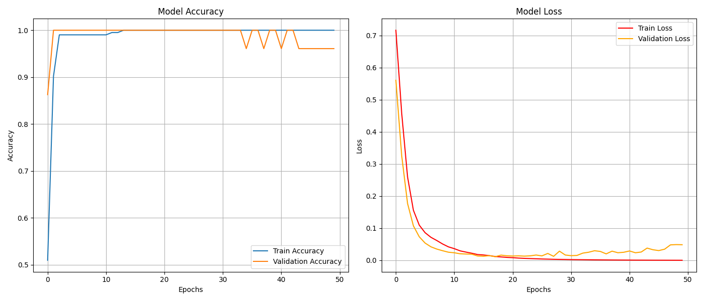

# APUF Neural Network Modeling


## 📖 Overview

This project simulates and models **Arbiter Physical Unclonable Functions (APUFs)** using neural networks. The goal is to generate challenge-response data for APUFs of different sizes and train a deep learning model to predict the response given a challenge.

## 📥 Installation

1. Clone the repository:
   ```bash
   git clone https://github.com/LEO0072003/PUF.git
   cd PUF
   ```
2. Install the dependencies:
    ```bash
    pip install -r requirements.txt
    ```
3. Generate the data:
    The dataset is generated using a custom method. The code generates challenge-response pairs for different bit lengths (8, 16, 32, 64).
    - `generate.ipynb`: This notebook generates the challenge-response data and saves it in CSV files.
    - `model.ipynb`: This notebook trains a neural network on the generated data.

## 📊 Usage

1. Generate challenge-response data:
   - Run `generate.ipynbpy` to create the challenge-response dataset.
   - You can specify the number of APUFs and the bit length in the script.

2. Train the model:
   - Run `model.ipynb` to train a neural network on the generated dataset.

## 📊 Sample Results

- Accuracy plots and performance metrics (loss, accuracy) are generated after each training run.
- Model performance improves with larger datasets and deeper architectures.

### Accuracy Plots

#### Model Accuracy for 8 bit circuit


#### Model Accuracy for 16 bit circuit


## 📄 Data Format

The generated CSV files contain:
- **Input**: The challenge bits.
- **φ (phi)**: The Phi vector generated from challenge bits.
- **Output**: The expected response.

## 🛠️ Tools Used

- Python 3.8+
- TensorFlow 2.19+
- NumPy
- Pandas
- Matplotlib
- Keras
